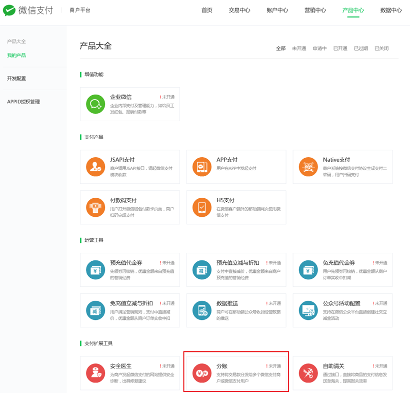
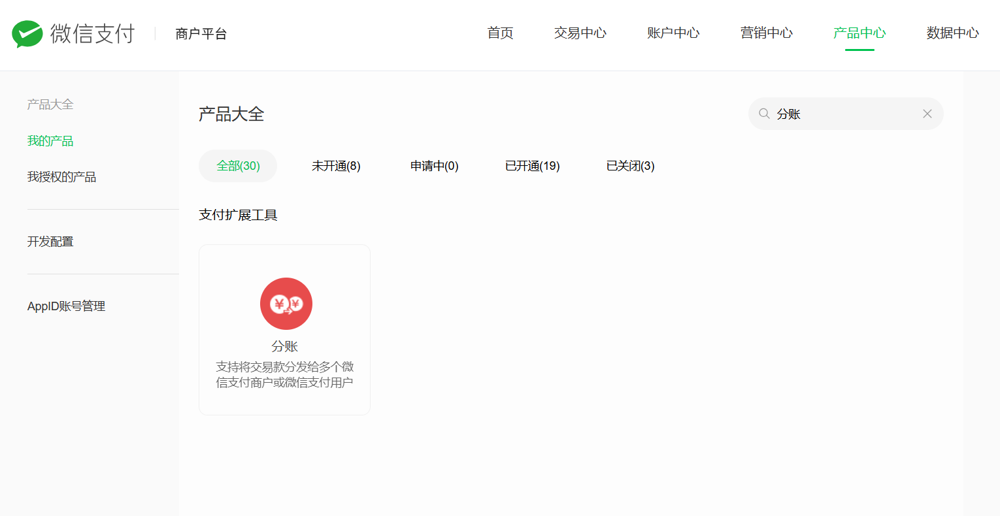
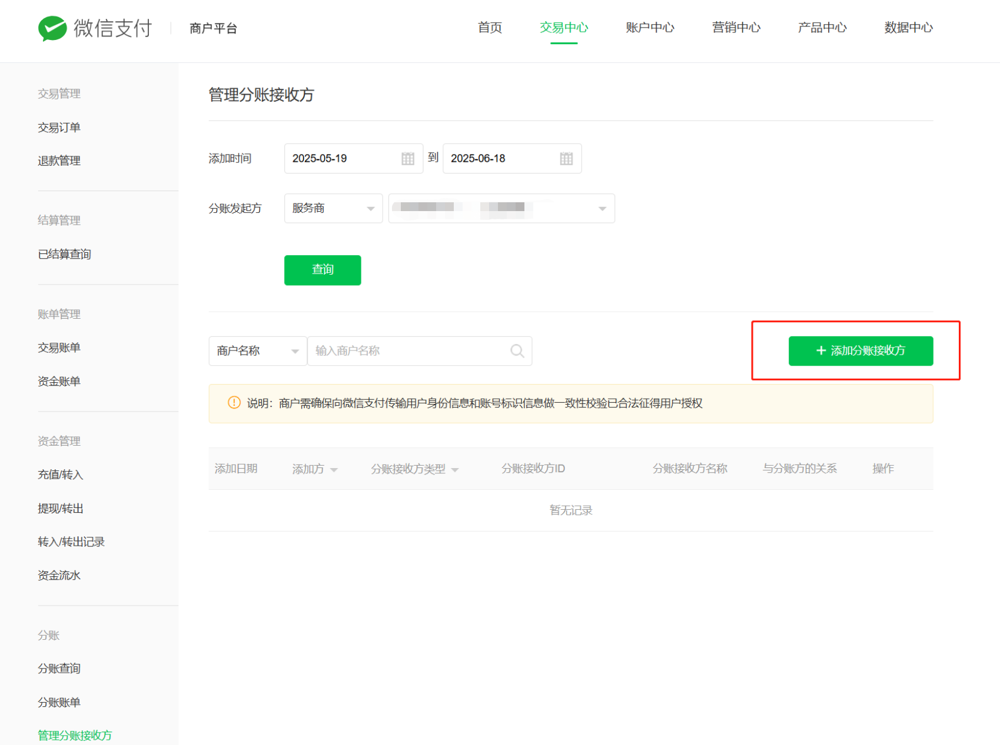
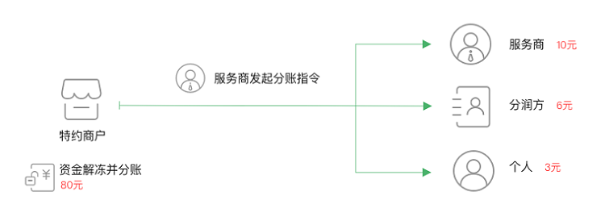
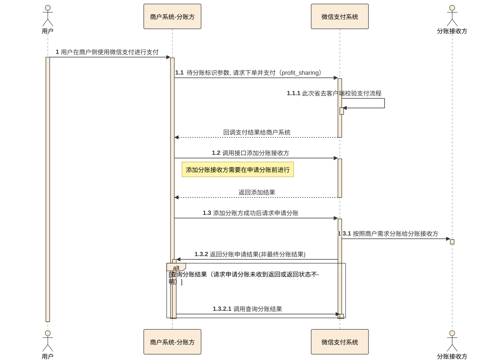

# 微信支付分账：商户平台操作指南（把合作商家加为分账接收方）

> **已弃用（2026-09-18）**：直连分账最高 30%，提额被微信按「平台统收涉及二清」拒绝。代拼的收款与分账改走持牌第三方支付机构，
> 操作看 `docs/third-party-sharing-guide.md`，后端规则看 `docs/order-api.md` §6。本文只留档，不要照着做。
> 已经做完的部分（商户号、API 安全三样、开通分账、比例 30%）不用撤，留着不碍事。

给平台运营看的操作手册。截图取自微信支付官方文档（`docs/img/wxpay-*.png`），后端接口部分见 `docs/order-api.md` §6。
商户号还在审核中的话，可以先看完，等号下来照着点。

## 0. 先看三条会影响方案的官方规则

| 规则 | 官方原文 / 数字 | 对我们的影响 |
|---|---|---|
| 分账比例上限 | 「目前默认最高分账比例为 30%」，最低可设 1%。超过 30% 要在商户平台提交「调整分账比例」申请并附材料，审核 3 到 7 个工作日 | 我们要给商家 90%，**必须先申请提额**。第三方经验：有自营业务、初创、接收方是个人的平台通过率不高，要有批不下来的准备 |
| 资金冻结期 | 「资金冻结期最长是 30 天，如果在 30 天内商户没有发起分账指令，则订单冻结资金将全部解冻」 | 支付后 30 天内必须分完，过期钱自动回到平台账户、不能再分。后端加保底：**支付后第 25 天还没分账就强制分** |
| 分账给个人 | 「单月个人收款限额 20w」；「分账给个人的资金：不支持分账回退」；分账给商户需接收方开启「同意分账回退」 | 商家是个人微信的，每月最多收 20 万；分出去就要不回来，所以只在订单完成后分 |

其他有用的数字：支付成功 1 分钟后才能分账；一笔订单最多分 50 次、每次最多 50 个接收方；分账本身不收费，
手续费 0.6% 在交易时已扣，「待分金额」就是扣完手续费的钱；分账接收方最多 2 万个。

**如果 90% 提额批不下来，两条备选路**（需要你拍板，不用现在决定，先申请再说）：

1. **服务商模式**：平台申请成为「微信支付服务商」（只对企业主体开放），每个商家做一个「特约商户」（个人凭身份证就能做小微商户，1 到 2 个工作日）。
   客户的钱直接进商家的特约商户号，平台只分自己的 10%，在 30% 以内不用申请。这是微信给「平台抽佣」设计的正规路子，后端下单要改用服务商接口。
2. **线下结算**：钱全进平台商户号，后台按订单算好每家应得，每周转账。不用任何审批，但资金过平台账户再付给商家，微信 30% 限制就是为了拦这种模式，量大了有合规风险。

## 1. 前提

- 商户号已审核通过、签完协议、完成打款验证，能用超级管理员微信登录 [pay.weixin.qq.com](https://pay.weixin.qq.com)。
- 已在「账户中心 → API 安全」设置 APIv3 密钥、申请并下载 API 证书、获取微信支付公钥。分账接口和支付接口共用这套。
- 小程序 AppID 已关联到这个商户号（小程序后台「微信支付 → 商户号管理」里能看到「已关联」）。

## 2. 第一步：开通分账产品

路径：商户平台 → 顶部「产品中心」→ 左侧「我的产品」→ 往下找「支付扩展工具」→ **分账**。



点进「分账」卡片 → 「申请开通」→ 阅读并签署《分账服务协议》→ 状态从「未开通」变「已开通」（一般即时生效）。
找不到就在产品大全右上角搜索框输入「分账」：



## 3. 第二步：设置分账比例并申请提额

路径：产品中心 → 分账（已开通后点进去）→ **分账管理比例**（页面上叫「订单分账最大比例」）。

1. 先把比例设到 **30%**（自助上限）。这样接口马上能联调，只是分账金额暂时被卡在订单金额的 30%。
2. 在同一页面提交**「调整分账比例」申请**，目标比例填 **90%**，材料按页面要求上传，通常需要：
   - 与商家签的代拼合作协议（写明平台抽 10%、商家 90%）
   - 业务说明（拼豆代拼平台，客户下单、平台派单、商家制作，附小程序截图）
   - 平台主体资质（营业执照）、合规承诺
3. 等 3 到 7 个工作日。审核通过后回到这一页把比例改成 90%。

被拒了就走第 0 节的备选路，不要试图用多次分账或改订单金额绕过，会被风控。

## 4. 第三步：把每个商家加为分账接收方

路径：商户平台 → 顶部「交易中心」→ 左侧最下面「分账」→ **管理分账接收方**。



（截图来自官方服务商文档，「分账发起方」那一栏我们选 **本商户** 即可。）

1. 点右侧绿色「**+ 添加分账接收方**」。
2. 按商家类型填表：

| 表单项 | 商家有自己的微信支付商户号 | 商家是个人（用微信零钱收） |
|---|---|---|
| 分账接收方类型 | 商户 | 个人 |
| 分账接收方 ID | 商家的商户号（10 位数字） | 商家在**咱们小程序**里的 openid（见下） |
| 分账接收方名称 | 商家商户号的企业/个体全称 | 商家微信实名的真实姓名，不一致会被拒 |
| 与分账方的关系 | 合作伙伴 | 合作伙伴 |

3. 提交后列表里出现该商家，状态正常即可。一个商家只用加一次。

**个人 openid 怎么拿**：让商家用自己的微信打开一次「拼豆便利店」小程序，后端登录表里就有他的 openid，
让开发在后台「商家管理」里查出来。openid 必须是本小程序 AppID 下的，别的公众号/小程序的不行。

**商家是商户号的，还要商家自己做一步**：他登录自己的商户平台 → 交易中心 → 分账 → 分账接收设置 → 开启「同意分账回退」。
不开的话我们退款时没法把已分的钱要回来。

**也可以让后端替你点**：后台「添加商家」直接调接口，参数就是上表那几项：

```
POST https://api.mch.weixin.qq.com/v3/profitsharing/receivers/add
{ "appid": "wx483d6f0b4bf6eaec", "type": "MERCHANT_ID" | "PERSONAL_OPENID",
  "account": "商户号或openid", "name": "<用微信支付公钥加密的姓名，可不传>", "relation_type": "PARTNER" }
```

## 5. 钱是怎么走的（以一单 100 元为例）

官方示意图（服务商场景，把图里的「特约商户」看成我们的商户号即可）：




| 环节 | 金额 | 说明 |
|---|---|---|
| 客户支付 | 100.00 | 用户价已含平台服务费与手续费（商家报价 89.46 ÷ 0.8946）；后端下单时带 `profit_sharing=true`，这笔钱在我们商户号里处于冻结 |
| 微信手续费 | 0.60 | 交易时直接扣，待分金额变成 99.40 |
| 订单完成 → 后端请求分账 | 商家 89.46 | `settle()`：99.40 × 90%，不低于商家报价，分账后商家可立刻提现 |
| 分账时带 `unfreeze_unsplit=true` | 平台 9.94 | 99.40 × 10%，剩余自动解冻到平台余额，T+1 可提现 |

分账在后端自动触发，运营不用在商户平台手动点；商户平台「交易中心 → 分账 → 分账查询 / 分账账单」能对账。

完整接口时序（官方）：



## 6. 后端要接的（开发看，对应 order-api.md §6）

1. JSAPI 下单：`settle_info: { profit_sharing: true }`。不带这个的订单永远不能分账。
2. 分账时机：订单 `done`（客户确认收货 / 10 天自动完成 / 后台手动完成）时分；另加定时任务，**支付后第 25 天仍未分账且未退款的订单强制分账**，不然第 30 天钱解冻就分不了了。
3. 分账前 `GET /v3/profitsharing/transactions/{transaction_id}/amounts` 取待分金额，分账额取 `min(merchantFen, unsplit_amount)`，
   其中 `merchantFen` 来自 `settle(实付)`：先扣微信 0.6%，净额的 90%（含运费，没有例外）。
4. `POST /v3/profitsharing/orders`，`unfreeze_unsplit: true`；结果异步，轮询 `GET /v3/profitsharing/orders/{out_order_no}`，`receivers[].result` 为 `SUCCESS` 才算完。
5. 退款：分账前直接退（从冻结资金退）；分账后只有商户号接收方能回退（`POST /v3/profitsharing/return-orders`，180 天内），个人接收方不能。

## 7. 分账失败怎么办（官方失败码）

| 失败码 | 意思 | 处理 |
|---|---|---|
| NO_RELATION | 没加接收方或被删了 | 回第 4 节重新添加，再重试 |
| RECEIVER_REAL_NAME_NOT_VERIFIED | 商家微信没实名 | 让商家去微信实名，再重试 |
| RECEIVER_RECEIPT_LIMIT | 商家当月收款超 20 万 | 下月重试，或让商家申请商户号 |
| ACCOUNT_ABNORMAL / RECEIVER_HIGH_RISK | 商家账户被风控 | 联系微信支付客服，别反复重试 |
| NO_AUTH | 分账权限被收回 | 商户平台重新申请分账权限 |
| INVALID_REQUEST | 描述里有敏感词 | 改 `description` 重试 |
| 金额被拒（超比例） | 分账额超过「订单金额 × 最大比例」 | 第 3 节提额还没批，或比例设置没改 |

## 8. 上线前自测

1. 用测试商家（先用你自己的微信当个人接收方）走一遍：加接收方 → 下一单最小单（100 颗，商家报价 1.00 元、用户付 1.20 元）→ 支付 → 后台派单、接单、发货 → 确认收货 → 商户平台「分账查询」看到该单分账成功、你的微信零钱到账 90% 净额。
2. 再下一单，付款后直接后台退款，确认全额原路退回、分账查询里没有记录。
3. 提额批下来之前，第 1 条会因为超 30% 失败，属正常；可以临时把 `PLATFORM_RATE` 调成 0.7 验证链路，验完改回。

## 9. 两方分工与先后顺序（合作商家为持照个体工商户，走商户号路线）

**商家（拼豆工作室）**

1. 用营业执照申请自己的微信支付商户号（pay.weixin.qq.com，主体选个体工商户：执照、经营者身份证、经营者银行卡、经营场所照片；1 到 5 个工作日；免费），通过后签协议、打款验证。
2. 登录他的商户平台：交易中心 → 分账 → 分账接收设置 → 开启「同意分账回退」。
3. 把商户号 + 执照全称给平台，填进合作协议附件二，双方签字盖章。
4. 之后每笔分账 T+1 自动结算到银行卡；交易中心 → 分账 → 分账账单 可查。

**平台**

1. 前提：商户号正常、AppID 已关联、API 安全（APIv3 密钥 / API 证书 / 微信支付公钥）配好交后端。
2. 产品中心 → 我的产品 → 支付扩展工具 → 分账 → 申请开通（第 2 节）。
3. 产品中心 → 分账 → 分账管理比例 → 先设 30%（第 3 节）。
4. 同页提交「调整分账比例」到 90%：签好的合作协议 + 商家执照 + 平台执照 + 业务说明 + 合规承诺，3 到 7 个工作日。
5. 交易中心 → 分账 → 管理分账接收方 → 添加：类型「商户」、商家商户号、执照全称、关系「合作伙伴」（第 4 节）。
6. 后端接入（第 6 节）。
7. 小额订单全流程验收（第 8 节）。

**顺序**：商家申请商户号与签协议现在就能做 → 平台商户号下来当天做完 2、3，立刻交 4（最慢）→ 等提额期间做 5、6，用 30% 先跑通 → 提额批了改 90%，验收上线。提额被拒则切服务商模式（商家有执照，做特约商户很顺）。

## 资料来源

- [分账 产品介绍](https://pay.weixin.qq.com/doc/v3/merchant/4012067962)、[开发接入准备](https://pay.weixin.qq.com/doc/v3/merchant/4012067989)、[开发指引](https://pay.weixin.qq.com/doc/v3/merchant/4012068033)
- [添加分账接收方](https://pay.weixin.qq.com/doc/v3/merchant/4012528995)、[请求分账](https://pay.weixin.qq.com/doc/v3/merchant/4012524936)、[请求分账回退](https://pay.weixin.qq.com/doc/v3/merchant/4012525287)
- [分账 常见问题](https://pay.weixin.qq.com/doc/v3/merchant/4014547102)（30 天冻结、20 万限额、比例入口、手续费口径都出自这里）、[分账失败处理指引](https://pay.weixin.qq.com/doc/v3/merchant/4015505684)
- [服务商模式分账 接入准备](https://pay.weixin.qq.com/doc/v3/partner/4012072589)（备选路线）
